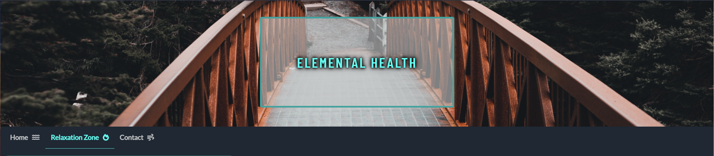
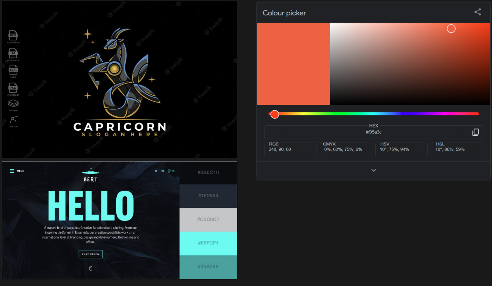
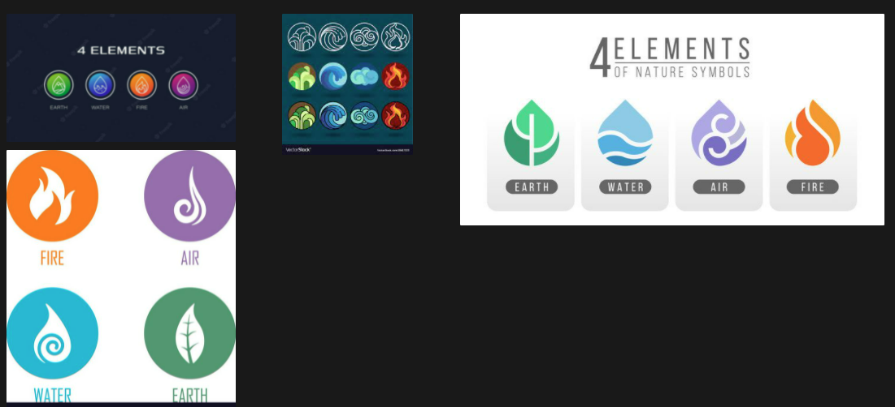

# Portfolio Project 1
## HTML/CSS Essentials

### Diploma in Software Development (E-commerce Applications)**

## **Assessment**

In this project, I will build a static front-end site to present useful information to users, using all the technologies that you have learned about so far.

Data is presented to help users achieve their goals, e.g. learning about a product/service in which they are interested. The presentation of this data advances the site owner's goals, e.g. helps them market a product/service.

### **Main Technologies**

**Required: HTML, CSS**
***
# Build a Meditation/Mindfulness/Yoga Website 

**External user’s goal:**

- The site’s users are interested in learning body/mind self-improvement techniques

**Site owner's goal:**

- The goal of the site is to teach users specific body/mind self-improvement techniques

**Potential features to include:**

- Technique categories and supporting information
- Technique lessons
- Supporting text/images/video demonstrating the technique
---
## First Steps 
For my Mindful site I had to go away and come up with a basic design and build from there.
Being familiar with Notion I built up my rough work and added styles and designs i wanted to include on my site. 

For my site I called it Elemental Health, And I using earths elements as part of the theme of mindfulness, health and yoga. , As elements are use to be moulded and mould others - I would hope popel who visit my site would leave with more knowledge and feeling better.

I created very broad mock-up's just to see how I liked the style or layout and could use that as jump off point and come up with a webpage layout.

[If you would like to see my rough work for this project](https://like-glitter-61c.notion.site/Rough-Work-a7fc52e597474844b98f4d7677430f10 "Notion Rough Work")

## Colours
I wanted to get the color and theme out the way so I could move on to the pages and layout.
I ended up with 3 choices to decide from which included these:

---

I settled my choice with the blue image, there where a lot of shades to choose from and they worked very well together, and I hoped they would make the site more appealing.

I did think to included icons as part of the navigation bar, either standalone or with so text, so reference images where collected and combined with teh color theme to see how they would look.

## Initial Concept

