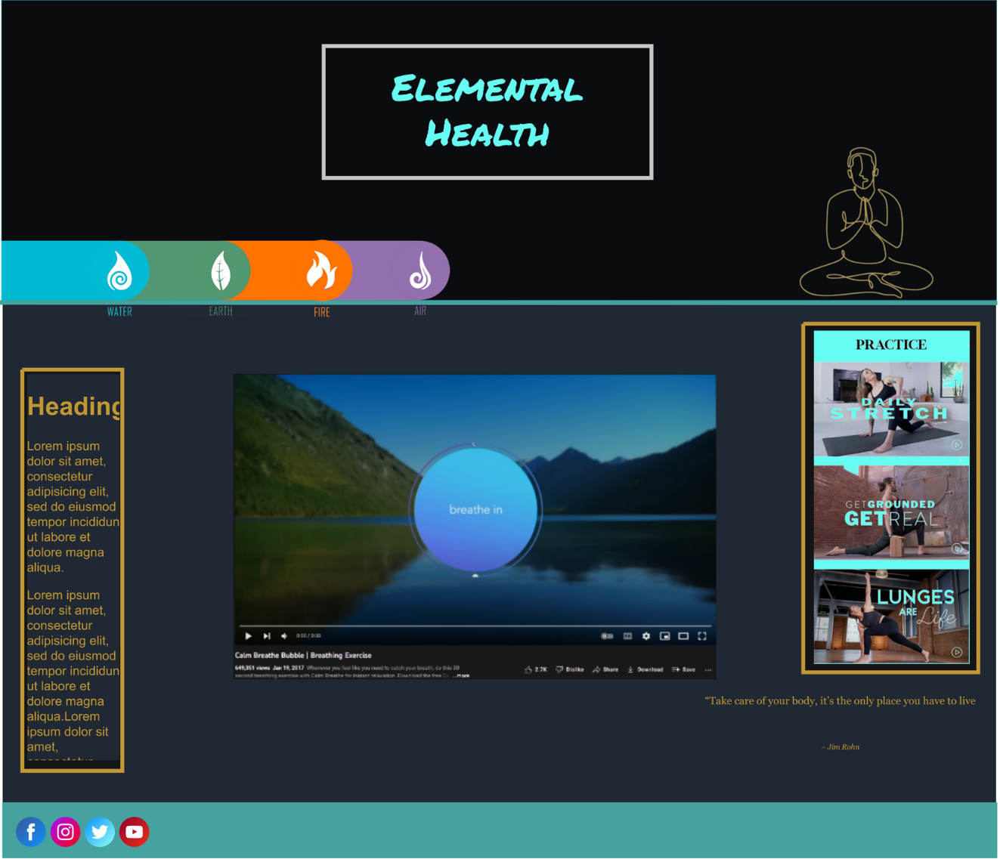
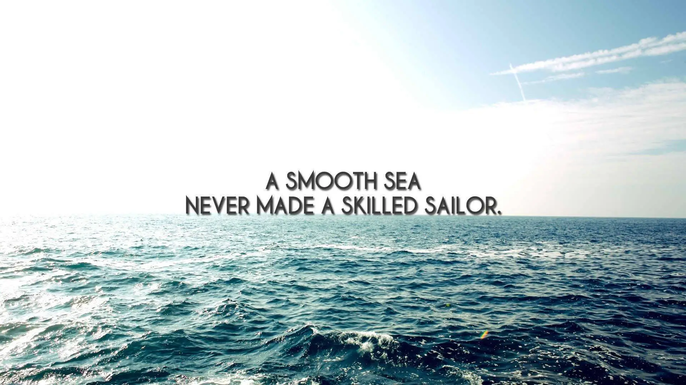

# **Health & Mindfulness Website**
## **Portfolio Project 1**

### **HTML/CSS Essentials**
### Diploma in Software Development (E-commerce Applications)  
### **Link to live site - https://lew94.github.io/Portfolio-1**
 

## **Aim**

For this site, I will build a static front-end site to present useful information to users, using all the technologies that I have learned about so far in HTML and CSS.  

**Potential features to include:**

- Technique categories and supporting information
- Technique lessons
- Supporting text/images/video demonstrating the technique

**Main Technologies**
Required: HTML, CSS

 

# Elemental Health
 

 

## **Initial Steps**
---

 

## Brainstorm:

For my Mindful site I had to go away and come up with a basic design and build from there.
Being familiar with Notion I built up my rough work and added styles and designs I wanted to include on my site. 

For my site I called it Elemental Health, And I using earths elements as part of the theme of mindfulness and health. elements are use to be moulded and mould others - I would hope people who visit my site would leave with more knowledge and feeling better.

I created mock-up's to create a visual representation of which I envisioned the site to look. I also used my design document to come up with features, Icons, Style, Theme and layout I would like to include on the site.

[If you would like to see my rough work for this project click this link [Notion page]](https://like-glitter-61c.notion.site/Rough-Work-a7fc52e597474844b98f4d7677430f10 "Notion Rough Work")

To figure out how I wanted my site to look I had 2 questions to answer:

**Who is this website for?**

The site’s users are interested in learning body/mind self-improvement techniques

**What would this site be used for?**

The goal of the site is to teach users specific body/mind self-improvement techniques

 

## **Layout**
---
 

## Final Design
So this is the final design of the website including the fonts, colors, icons and page layout.

The final design consist of:

- 3 main web pages
    - Home page - index.html
    - Media page - relax.html
    - Contact page - contact.html

     
- Custom built privacy policy page
- 2 separate confirmation page's one for contact form and the other for the news letter sign-up 

The site will include media :

 - MP3
 - GIF
 - Jpg, png, webp
 - Youtube video

 Website should adjust when on different screen sizes:
 
- Monitors
- Laptops
- phones

 

## Fonts:
For my website I have decided to use these for my font family:

**Headings**

- Barlow-condensed

Barlow is a low-contrast, sans serif type with slightly rounded edges. With its tallish letters, Which I hope will make the headings pop and pair nicely with the color picked for them.

**Text**

- Lato 400

Lato is a simple font that works well with barlow but without over-shadowing it. The text is easy to read and visually appealing. I can use many font weight's and sizes and still retain the look im going for.
All font are free to use for personal and commercial use:
- 1001 Fonts  - [Barlow Condensed](https://www.1001fonts.com/barlow-condensed-font.html "1001 Fonts")
- Google Fonts - [Lato 400 ](https://fonts.google.com/specimen/Lato?query=lato "fonts.google.com")

## color:
For My site I wanted color that would pop and attract the viewer attention on the page, but without being to full on as this site is about relaxing and mindfulness. I searched online for visual representation when I came across my first choice, mixtures of grey, gold and black. I like how they complemented each other and thought it would give a rich and warm feeling to the site. I did worry that the color would give a business feeling to my site so decided to find a new palette.

---
I came across the color palette below and thought it was great and I they make the site more appealing, The color worked well together, I paired them with my fonts and they looks perfect together. I did try swapping out the blue shades for a more orange tone, but after testing my preference was with the original blue.

color palette:

- #66FCF1  #66FCF1
- #45A29E  #66FCF1
- #C5C6C7  #66FCF1
- #1F2833  #66FCF1
- #0B0C10  #66FCF1

---

## Icon's:

I did think to included icons as part of the navigation bar, either standalone or with so text, so reference images where collected and combined with teh color theme to see how they would look.
 

 

I went to Font awesome to find icons that would suit the style and theme I was looking for, After searching I came across the icons below and incorporated them into my site on the nav-bar. For my site I paired the icons with text for each page. 
 

 
 

## **Web Page Layout:**
---
 

This site includes a header, nav-bar and footer which will be universal for most pages except on the privacy policy and submit confirmation pages.
 

**Header**

The header has the name of the of the page centered, includes an anchor with a h1 font with a border around the text. The anchor link will lead the user back to the home screen (index.html) The whole header has a background image styled in-line with the theme of the site, to be relaxing and calming.

 

**Navbar**

The nav-bar is positioned underneath the header and aligned to the left. There are 3 pages so there are 3 page links in the bar. Each nav-link includes name of the page and icon. I also included animation to the icons when the user hovers over and the color changes from grey (#C5C6C7) cyan(#66FCF1) on the webpage selected.

 

**Footer**

The footer bar is fixed to the bottom so the user has to scroll down to the bottom to see. The footer includes short text and icons for the social links colored in cyan (#66FCF1) and an dark grey (#1F2833) background. Icons are again from Font awesome, Each icon link open in new tab.

 

## **Web Page's Details**

---
 

## Features:
 

This Site includes:
- Text
- Images
    - JPEG
    - PNG
    - WEBP
- Gifs
- Audio player
    - MP3
- Youtube player
    - iplayer

- contact sheet

- News letter sign-up

- Privacy policy
    - termly custom build policy

## Frameworks:

**Bootstrap**

I am using Bootstrap, for its built-in grid system, I found it very helpful to position and layout the items on the page. Bootstrap comes with a lot of preset features that allowed easy and fast modification to the elements.
 
 

## Media:

**Audio**

The site includes mp3's, These are a collection of calming sounds for the user to listen to, With the hope of giving calming effect. I used bootstrap to build the mp3 in a grid. Each column includes audio player, image related to the sound inclosed in colored border. they are stacked 3x3 while on large screens, but stack 1x1 on smaller devices. 

 

**Gifs**

The relax.html page includes 3 gifs, which auto play and loop while on the page. The gifs are in colored border, and spaced evenly on the center of the page. The gifs are 3x3 on large screens then 1x1 on smaller devices.

 

**Youtube Player**

The relax.html page ends with a video from youtube, The Youtube video is embedded using iframe. The player is centered and colored border added. The video doesn't start until the user click play. The payer size adjust for different device screen sizes.

 

**Image**

The home page includes an image, This is to add the calming and mindful theme to the page. The image include motivational message to inspire the user.

 

## Inputs & Outputs:

**Inputs**

On the site the are two forms, one for news letter sign-up and one for the user to contact us. 
Each form includes a textbox with a label and a animated submit button. Each textbox is required to be filled in before it can be submitted. There is a section to enter email address and it is validated to make sure a email is entered. Once all criteria is met the user greeted but the successful submission page for each form, This page has an image, small text with information and a link back to the home page.

**Outputs**

When the user clicks any anchor link on any page the browser open on a new tab. This includes the form submits. The links also open in new tab on the privacy.html page, but some of the other link on the page link to different parts of the page and will not open in new tab. 

 

## **Build and host**
---

All the code was built using Visual studio web IDE, Which was hosted on GitPod. [Code was often committed and pushed to my Github repository.](https://github.com/lew94/Portfolio-1 "Github Repository") The site was deployed using Github Pages, which can be found here: https://lew94.github.io/Portfolio-1/ for the latest view.

 

**Here are the current screen shot of each page:**

## Home Page
### index.html

## Relaxation Zone Page
### relax.html

## Contact Page
### contact.html

## Privacy Policy Page
### privacy.html

## Contact Form Submission Page
### submission.html

## News Letter Submission Page
### email-submit.html

## **Testing**
---
 

Once the site was completed I had to test it to make sure the the screen behaved accordingly and reacted when screen size changed. The site was tested with the Devtools built into the browser. This allowed me to set the screen size to different device and included and size slide.
The site reacts well with different screen sizes and is suitable for most devices. 

## Validator:

All the HTML and CC was ran through the W3 validator to find any errors or warnings the results are below:

**CSS**

The .css page was copied and pasted into the direct input section of the validator, once it ran it presented the results. No errors found, there were a few warning but this was regarding the vendor extensions that the validator has problems understanding, One warning about the imported Google fonts but the system doesn't scan others code just mind so thats why its flagged.

**HTML**

Each HTML page was copied and put in the direct input and run one by one, the results was then presented. All HTML page were successful with no errors or warnings. 

 

## LightHouse:

Lighthouse is a feature as part of the DevTools browser tools. Lighthouse is an automated tool for improving the quality of web pages by check the responsiveness and quality of the pages and how the load. After the test runs you are presented with score and report. I ran Lighthouse on my site and received a medium-high score, it showed me area I needed to improve, mainly the image format and font load times take a while so I needed to included font-switch. After changing the images to Webp and adding a font-switch I gained a much better score.

 

## Problems/ Bugs:

Currently there are no problems or bugs on the site, that I am aware of. The site is small and has been heavily tested and no issues are currently causing any issue.

 

## **Resources**
---
I would like to credit all the site that I used in the building of this site.

## Images:

**Pixebay -** https://pixabay.com/

 

## Gifs:

**Giphy -** https://giphy.com/

 

## Video:

**Youtube -** https://www.youtube.com/

 

## Fonts:

**Google Fonts -** https://fonts.google.com/

**1001 Fonts -** https://www.1001fonts.com/

 

## Animation:

**Github IanLunn/Hover  -** https://github.com/IanLunn/Hover

 

## Custom Privacy Policy:

**Termly  -** https://termly.io/products/privacy-policy-generator/

 
## IDE and Hosting sites:

**Visual Studio Web -** https://code.visualstudio.com/docs/editor/vscode-web

**Github -** https://github.com/

**Gitpod -** https://www.gitpod.io/

**Github Pages -** https://pages.github.com/

 

## **Acknowledgements**
---
 

I just want to use this space to acknowledge all those that helped me to complete this site and this assignment.

I want to thank all those at Code Institute all the facilitators and mentors that helped answer my questions
and provided constructive feedback. I wouldn't be able to complete this project without there help.

I also want to thank all those on the slack chatroom that help point me in the right direction or help provided answers to my question's.

A few sites that I want to acknowledge for all there advice, help and all-around knowledge:

**Stack Overflow -** https://stackoverflow.com/

**Bootstrap -** https://getbootstrap.com/

**W3schools -** https://www.w3schools.com/

**Code Institute -** https://codeinstitute.net/ie/

Without all these resources I would not be able to complete my task and have it look so good, So a special thank you to all those involved.